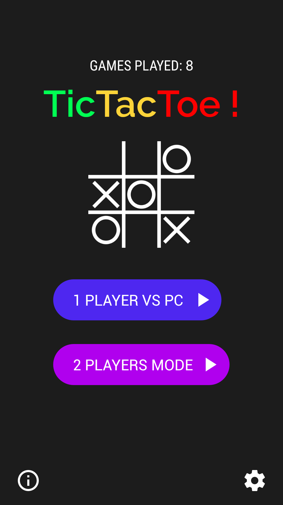
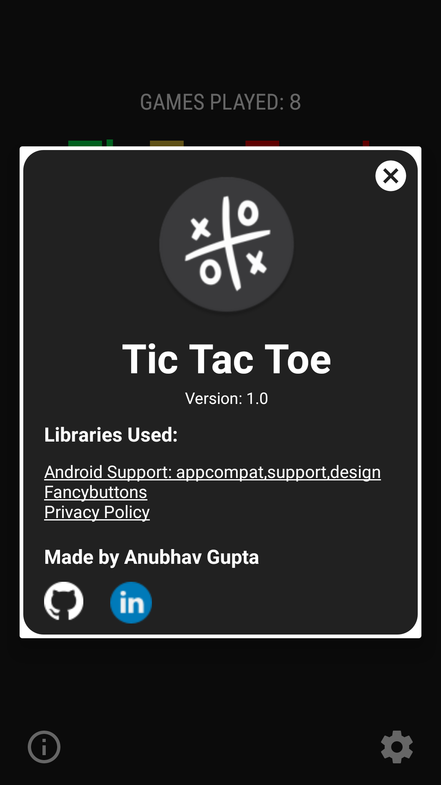
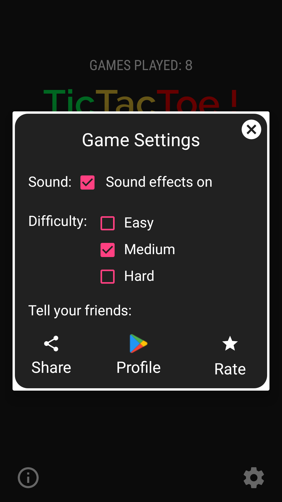
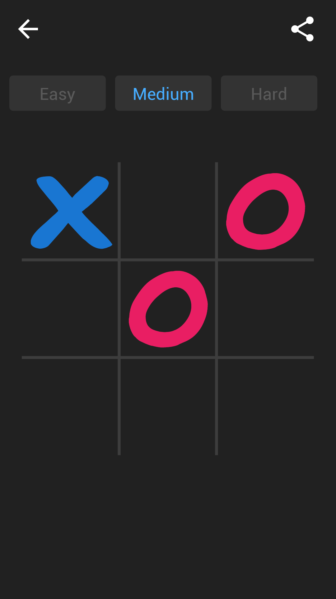
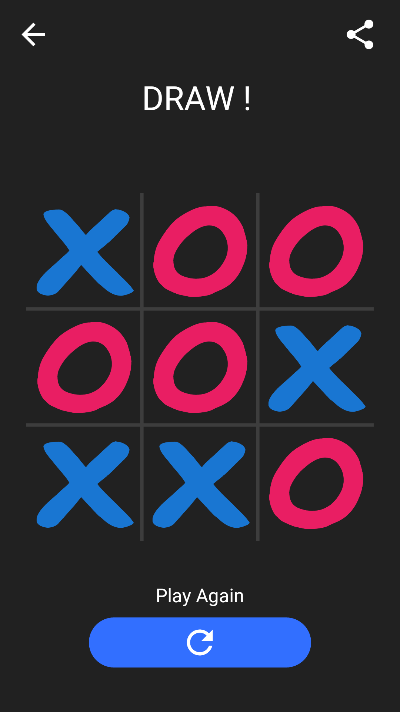

     

# Tic Tac Toe 

Tic Tac Toe is free classic puzzle game also known as "noughts and crosses or sometimes X and O", it also is ad-free and open source under MIT license. Get Free Tic Tac Toe now and let the fun begins!. 

  

## Screenshots

## Features
 
 * 3 different game levels (game difficulties).
 * 2 players game (multiplayer).
 * TicTacToe Game for Android 4.3+.
 * Cool UI Design.
 
#### Contributing
 
###### Code 
If you are a developer and you wish to contribute to the app please fork the project
and submit a pull request on the [master branch](https://github.com/gupta1anubhav/TicTacToe/tree/master).

###### Issues
You can trace the status of known issues [here](https://github.com/gupta1anubhav/TicTacToe/issues),
also feel free to file a new issue (helpful description, screenshots and logcat are appreciated), or send me an [email](mailto:anubhav.dev97@gmail.com) if you have any questions.

#### Licensing
TicTacToe is licensed under the [MIT License](https://github.com/gupta1anubhav/TicTacToe/blob/master/LICENSE.md).
In addition to the terms set by the MIT License, we ask that if you use any code from this repository that you send us a message to let us know. 

#### Developed By

Anubhav Gupta - <anubhav.dev97@gmail.com>

<a href="https://www.linkedin.com/in/anubhav-gupta-453116156/">
   